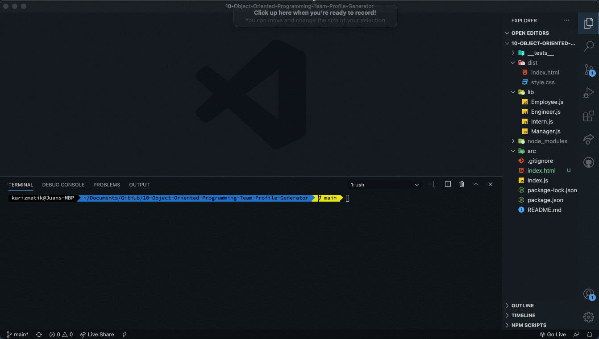

# Team Profile Generator


## Description

Build a Node.js command-line application that takes in information about employees on a software engineering team, then generates an HTML webpage that displays summaries for each person.

### Table of Contents

* [Installation](#installation)

* [Usage](#usage)

* [Tests](#tests)

* [License](#license)

* [Questions](#questions)

## Installation

 Jest for running the unit tests and Inquirer for collecting input from the user

## Usage

```bash
node index.js
```


## Tests

```bash
npm test
```



## License

This project is licensed under the MIT License.
Click [Link](https://choosealicense.com/licenses/mit/) for more information.

## Questions

Juan Sanchez

[Github Profile](https://github.com/karizmatik215)

juan.sanchez@phila.gov
